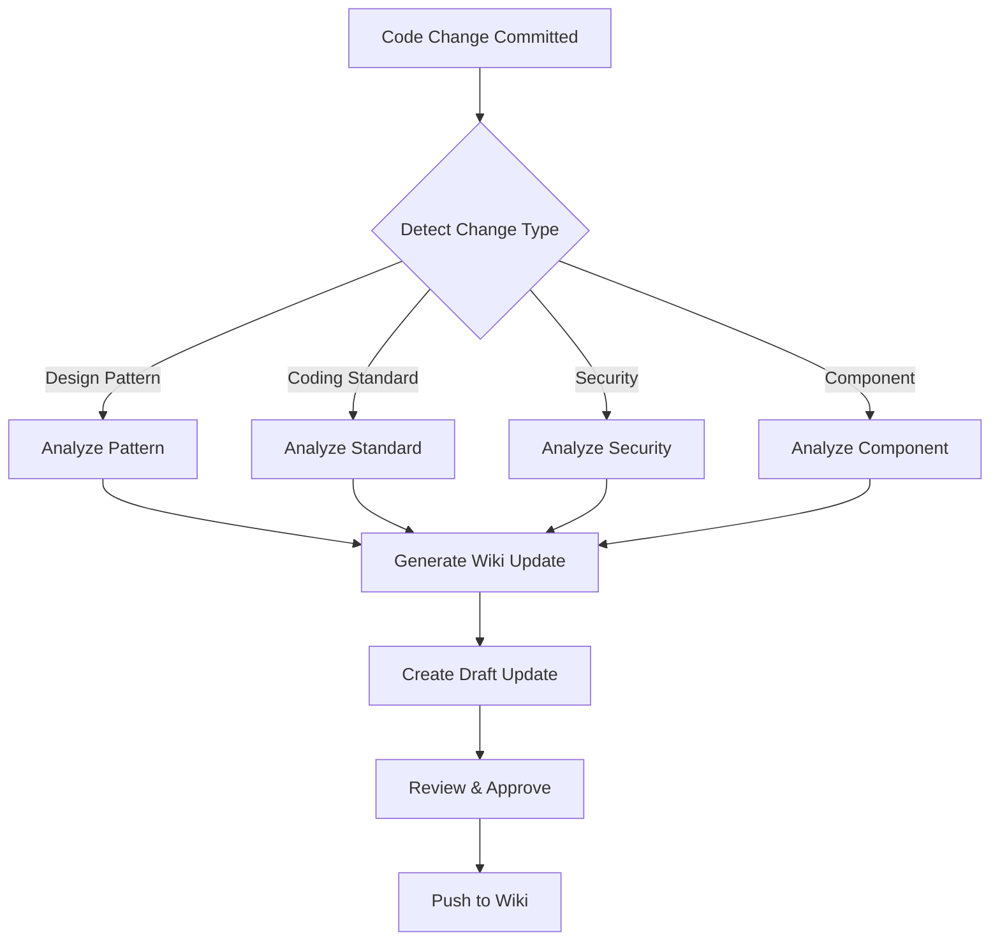

# Wiki Updater Skill

This skill automatically detects when code changes introduce new patterns, modify standards, or update security practices, and proposes updates to the corresponding GitHub Wiki pages.

## When This Skill Activates

This skill is automatically invoked when:
- New design pattern is introduced (new class pattern in `/lib/`)
- Coding standard is modified (ESLint, Prettier, TypeScript config changes)
- Security implementation changes (auth, validation, secrets management)
- New component pattern emerges (reusable pattern in `/components/`)
- Architecture decision is made (major refactoring or new structure)

## Detection Rules

### 1. Design Pattern Changes

**Triggers:**
- New file added to `/src/lib/` with class definition
- Singleton pattern implementation
- New configuration class
- Custom error class definition

**Wiki Page**: `05-Design-Patterns.md`

**Example Detection:**
```bash
# Detects new API client pattern
git diff --name-status | grep "^A.*src/lib/.*client\.ts$"
```

### 2. Coding Standard Changes

**Triggers:**
- `.eslintrc.js` or `eslint.config.js` modified
- `prettier.config.js` modified
- `tsconfig.json` strict mode or rules changed
- New naming convention introduced

**Wiki Page**: `01-Coding-Standards.md`

**Example Detection:**
```bash
# Detects config changes
git diff --name-status | grep -E "(eslint|prettier|tsconfig)\..*\.js"
```

### 3. Security Practice Changes

**Triggers:**
- New authentication method
- CSRF/XSS protection implementation
- Secrets management change
- Security headers modification

**Wiki Page**: `04-Security-Best-Practices.md`

**Example Detection:**
```bash
# Detects security-related changes
git diff --unified=0 | grep -i -E "(auth|csrf|xss|security|secret)"
```

### 4. Component Pattern Changes

**Triggers:**
- New component composition pattern
- Props interface convention change
- New hook pattern for components
- Performance optimization pattern

**Wiki Page**: `06-Component-Guidelines.md`

**Example Detection:**
```bash
# Detects new component patterns
git diff --name-status | grep "^A.*src/components/"
```

## How It Works



## Update Process

### 1. Change Detection
```bash
# Run after commit
./wiki-updater.sh detect

# Output:
# ✓ Detected new Singleton pattern in src/lib/payment-client.ts
# ✓ Detected security change in vercel.json (CSP headers)
# → Suggesting updates to:
#    - 05-Design-Patterns.md
#    - 04-Security-Best-Practices.md
```

### 2. Generate Update Draft
```bash
# Generate update content
./wiki-updater.sh generate

# Creates:
# .claude/wiki-updates/design-patterns-update.md
# .claude/wiki-updates/security-update.md
```

### 3. Review & Approve
```bash
# Review proposed changes
cat .claude/wiki-updates/*.md

# Approve and push
./wiki-updater.sh apply
```

## Update Template

When a change is detected, the skill generates an update in this format:

```markdown
## 📝 Proposed Wiki Update

**Wiki Page**: 05-Design-Patterns.md
**Section**: Singleton Pattern
**Change Type**: New Implementation

### Current Content
[Existing pattern documentation]

### Proposed Addition
```typescript
// Payment Client Singleton Pattern
export class PaymentClient {
  private static instance: PaymentClient;

  private constructor() {
    // Initialization
  }

  public static getInstance(): PaymentClient {
    if (!PaymentClient.instance) {
      PaymentClient.instance = new PaymentClient();
    }
    return PaymentClient.instance;
  }
}
```

### Rationale
New PaymentClient follows existing Singleton pattern for API clients.
Maintains consistency with APIClient and AuthClient implementations.

### Related Files
- src/lib/payment-client.ts (new)
- src/lib/api-client.ts (reference)

### Action Required
- [ ] Review generated documentation
- [ ] Approve update
- [ ] Push to wiki
```

## Configuration

**`.claude/wiki-updater.config.json`**:
```json
{
  "enabled": true,
  "auto_detect": true,
  "require_approval": true,
  "watch_patterns": [
    "src/lib/**/*.ts",
    "src/components/**/*.tsx",
    "*.config.js",
    "tsconfig.json",
    "vercel.json"
  ],
  "wiki_pages": {
    "design_patterns": "05-Design-Patterns.md",
    "coding_standards": "01-Coding-Standards.md",
    "security": "04-Security-Best-Practices.md",
    "components": "06-Component-Guidelines.md"
  },
  "github": {
    "repo": "glycogrit-team/glycogrit-frontend",
    "wiki_branch": "master"
  }
}
```

## Safety Features

✅ **Review Required** - Updates are never pushed automatically
✅ **Diff Preview** - Shows exactly what will change
✅ **Rollback Support** - Can revert wiki changes if needed
✅ **Conflict Detection** - Warns if wiki was manually edited
✅ **Dry Run Mode** - Test without making changes

## Example Workflows

### Workflow 1: New Design Pattern

```bash
# Developer adds new pattern
git add src/lib/cache-manager.ts
git commit -m "Add CacheManager singleton pattern"

# Wiki updater detects
→ New Singleton pattern detected
→ Generating documentation for 05-Design-Patterns.md

# Review and approve
./wiki-updater.sh review
./wiki-updater.sh apply

# Wiki updated with:
# - New CacheManager example
# - Usage documentation
# - Benefits section
```

### Workflow 2: Coding Standard Change

```bash
# Update ESLint config
git add eslint.config.js
git commit -m "Enforce no-console in production"

# Wiki updater detects
→ ESLint rule change detected
→ Generating update for 01-Coding-Standards.md

# Adds to wiki:
# - New rule explanation
# - Rationale
# - Examples of compliant code
```

### Workflow 3: Security Enhancement

```bash
# Add CSP headers
git add vercel.json
git commit -m "Add Content Security Policy headers"

# Wiki updater detects
→ Security header change detected
→ Generating update for 04-Security-Best-Practices.md

# Adds to wiki:
# - CSP configuration
# - Why it's important
# - Testing instructions
```

## Integration with Other Skills

| Skill | Integration |
|-------|-------------|
| **wiki-context** | Provides current wiki state for comparison |
| **code-review** | Triggers update detection after PR merge |
| **arch-check** | Validates new patterns before wiki update |
| **name-check** | Ensures naming in wiki matches new standards |

## Manual Trigger

You can manually trigger wiki updates:

```bash
# Check for updates
/wiki-updater detect

# Generate updates for specific file
/wiki-updater generate src/lib/new-pattern.ts

# Force update (skip detection)
/wiki-updater update --force --page design-patterns
```

## Monitoring

The skill logs all detections and updates:

```
.claude/wiki-updates/
├── log.txt              # All detections
├── pending/             # Proposed updates awaiting review
│   ├── design-patterns-2024-04-14.md
│   └── security-2024-04-14.md
└── applied/             # Successfully applied updates
    └── design-patterns-2024-04-13.md
```

## Benefits

✅ **Always up-to-date documentation** - Wiki stays in sync with code
✅ **Reduced manual effort** - Automates documentation updates
✅ **Consistency** - Ensures patterns are documented consistently
✅ **Onboarding** - New developers see latest standards
✅ **Audit trail** - Track when and why wiki changed

## Related Commands

```bash
# Check status
/wiki-updater status

# List pending updates
/wiki-updater list

# Review specific update
/wiki-updater review design-patterns

# Apply all pending
/wiki-updater apply --all

# Rollback last update
/wiki-updater rollback
```

---

**Last Updated**: April 14, 2024
**Related Skills**: wiki-context, code-review, arch-check
**Wiki Location**: https://github.com/glycogrit-team/glycogrit-frontend/wiki
